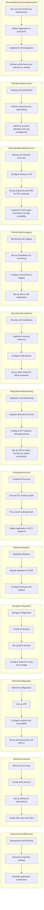

# AWS Cloud  Migration

## Sequence Diagram

```mermaid
graph LR

    subgraph AssessmentAndPlanning
    A[Assessment and Planning] --> B[Determine migration strategy]
    B --> C[Evaluate application architecture]
    end

    subgraph AWSAccountSetup
    D[AWS Account Setup] --> E[Create AWS account]
    E --> F[Set up billing and subscriptions]
    F --> G[Create IAM users and roles]
    end

    subgraph NetworkConfiguration
    H[Network Configuration] --> I[Set up VPC]
    I --> J[Configure subnets and route tables]
    J --> K[Set up security groups and NACLs]
    end

    subgraph StorageConfiguration
    L[Storage Configuration] --> M[Create S3 buckets]
    M --> N[Set up EBS volumes]
    N --> O[Configure Glacier for long-term storage]
    end

    subgraph DatabaseMigration
    P[Database Migration] --> Q[Migrate databases to RDS]
    Q --> R[Configure backups and replicas]
    end

    subgraph ComputeResources
    S[Compute Resources] --> T[Choose EC2 instance types]
    T --> U[Set up auto-scaling groups]
    U --> V[Deploy application on EC2 instances]
    end

    subgraph IntegrationAndNetworking
    W[Integration and Networking] --> X[Integrate with AWS services]
    X --> Y[Configure API Gateway, message queues]
    Y --> Z[Set up VPN or Direct Connect for hybrid connectivity]
    end

    subgraph SecurityAndCompliance
    AA[Security and Compliance] --> AB[Implement security measures]
    AB --> AC[Configure IAM policies]
    AC --> AD[Set up WAF, Shield for DDoS protection]
    end

    subgraph MonitoringAndLogging
    AE[Monitoring and Logging] --> AF[Set up CloudWatch for monitoring]
    AF --> AG[Configure CloudTrail for logging]
    AG --> AH[Set up alarms and notifications]
    end

    subgraph BackupAndDisasterRecovery
    AI[Backup and Disaster Recovery] --> AJ[Configure backup to S3]
    AJ --> AK[Set up snapshots and AMIs for EC2 instances]
    AK --> AL[Implement multi-region redundancy for high availability]
    end

    subgraph TestingAndOptimization
    AM[Testing and Optimization] --> AN[Perform functional and load testing]
    AN --> AO[Optimize resource utilization and cost management]
    end

    subgraph GoLiveAndContinuousImprovement
    AP[Go Live and Continuous Improvement] --> AQ[Deploy application to production]
    AQ --> AR[Implement CI/CD pipelines]
    AR --> AS[Monitor performance and optimize as needed]
    end

```